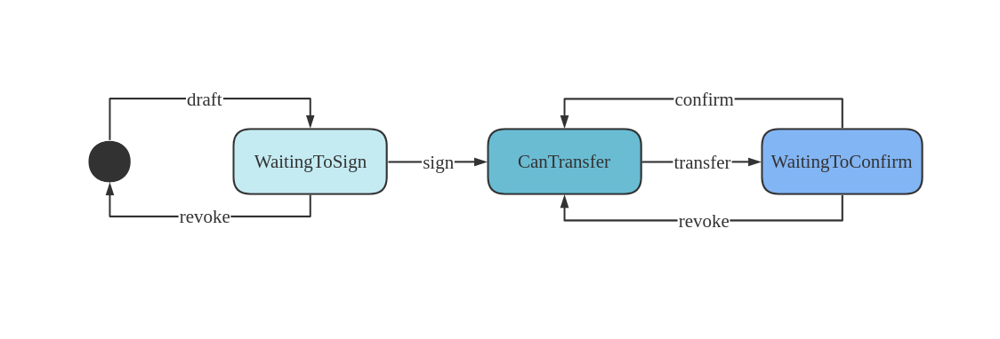
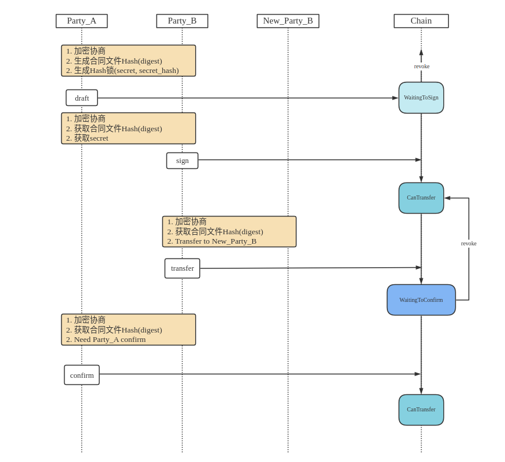

### pallet-talent-contract

### 1. Intro
定义如下场景:

甲方(party_a)是签约人才,乙方(party_b)是签约公司, 
新乙方(new_party_b)是合约转让中出现的角色.
甲乙双方通过加密终端建立联系, 并在链上留下签约的关键信息.
链上信息是公开的,为了保证甲乙双方的签约过程不被第三方破坏且可以撤销,
我们使用了Hash时间锁技术.






### 2. 签约过程(合同起草人和合同签订人): draft, sign
#### (a) draft

甲乙双方任意一方都可在链上起草(draft)一份人才签约合同

前置条件: 
  - 合同起草人链下生成签约文件的32字节hash
  - 合同起草人链下生成Hash锁(blake2_256 hash算法): (secret, secret_hash)

`draft(origin, digest, secret_hash, is_party_a)`

参数解析:
  - origin: 合同起草人
  - digest: 32字节文件Hash
  - secret_hash: 合同起草人设置的hash锁
  - is_party_a: 合同起草人是甲方还是乙方.

链上合同状态: `WaitingToSign`

#### (b) sign
甲乙双方通过加密终端建立联系,合同起草人在加密环境下将secret传递给合同最后签订人

前置条件:
  - 当前链上合同状态处于WaitingToSign
  - 合同签订人获知secret


`sign(origin, digest, secret)`

参数解析:
 - origin: 合同签订人
 - digest: 32字节文件Hash
 - secret: Hash锁原文

链上合同状态: `Cantransfer`

### 3. 合同转让过程(合同转让发起人, 合同转让确认人): transfer, confirm
链上合同的所有者属于甲乙双方,
甲乙双方都可以发起transfer, 来更改链上合同的乙方,然后由另一方确认并完成链上合同的转让.
#### (1) transfer
甲或乙方通过加密终端与新的乙方建立联系

前置条件:
  - 链上合同处于CanTransfer状态

`transfer(origin, digest, new_party_b)`

参数解析:
  - origin: 合同转让发起人
  - digest: 32字节文件Hash
  - new_party_b: 新的乙方

链上合同状态: WaitingToConfirm

#### (2) confirm
链上合同的所有者属于甲乙双方,所以需要一方发起，另一方确认来完成链上合同的转让操作

前置条件:
  - 链上合同处于WaitingToConfirm状态,且匹配请求的confirmer

`confirm(origin, digest)`

参数解析:
origin: 合同转让确认人
digest: 32字节文件Hash

### 4. 撤销签约过程或转让过程: revoke
有效期是1小时, 有效期内只能由链上合同的甲方或乙方撤销, 超过有效期可以由任意人撤销.

- draft之后链上合同的状态为`WaitingToSign`, 撤销后, 删除该链上合同.
链上合同状态: `无`

- transfer之后链上合同的状态为`WaitingToConfirm`, 撤销后, 该链上合同的状态回退到CanTransfer
链上合同状态: `CanTransfer`

### 5. custom types

```json
{
  "Address": "MultiAddress",
  "LookupSource": "MultiAddress",
  "BlockNumber": "u32",
  "Status": {
      "_enum": {
        "WaitingToSign": "H256",
        "WaitingToConfirm": "(AccountId, AccountId)",
        "CanTransfer": null
      }
  },
  "Contract": {
      "digest": "H256",
      "status": "Status",
      "updated": "BlockNumber",
      "party_a": "Option<AccountId>",
      "party_b": "Option<AccountId>"
  }
}
```
