# Interacting with MinixChain Using Remix

## Introduction

Remix is one of the commonly used development environments for smart contracts on Ethereum. Given MinixChain’s Ethereum compatibility features, Remix can be used directly with a MinixChain  node.

This guide walks through the process of creating and deploying a Solidity-based smart contract to a MinixChain  node using the [Remix IDE](https://remix.ethereum.org/).

## Getting Started with Remix

Now, let’s fire up Remix to exercise more advanced functionalities in MinixChain.

Launch Remix by navigating to https://remix.ethereum.org/. In the main screen, under Environments, select Solidity to configure Remix for Solidity development, then navigate to the File Explorers view:


We will create a new file to save the Solidity smart contract. Hit the + button under File Explorers and enter the name "MyToken.sol" in the popup dialog:

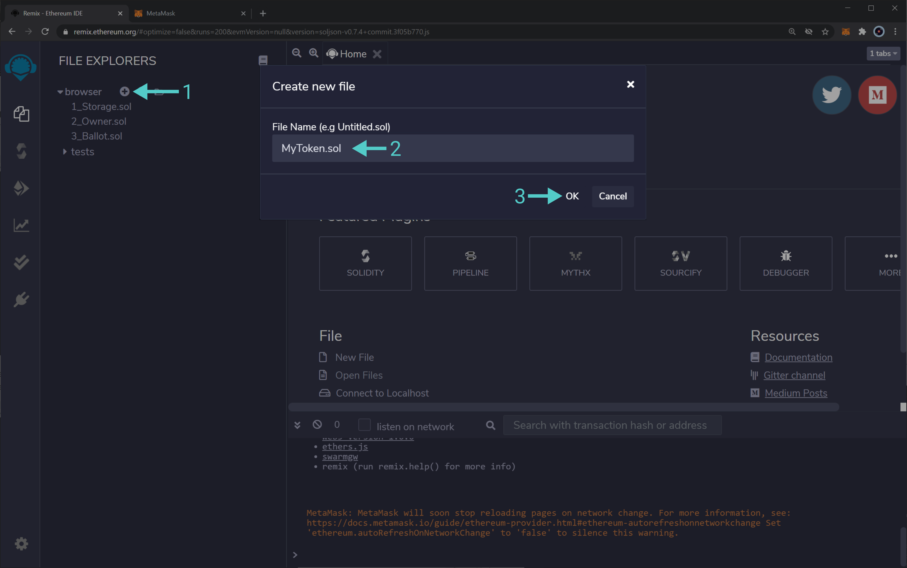

Next, let's paste the following smart contract into the editor tab that comes up:

```
pragma solidity ^0.7.0;

import 'https://github.com/OpenZeppelin/openzeppelin-contracts/blob/release-v3.2.0-solc-0.7/contracts/token/ERC20/ERC20.sol';

// This ERC-20 contract mints the specified amount of tokens to the contract creator.
contract MyToken is ERC20 {
  constructor(uint256 initialSupply) ERC20("MyToken", "MYTOK") {
    _mint(msg.sender, initialSupply);
  }
}
```

This is a simple ERC-20 contract based on the current Open Zeppelin ERC-20 template. It creates MyToken with symbol MYTOK and mints the entirety of the initial supply to the creator of the contract.

Once you have pasted the contract into the editor, it should look like this:

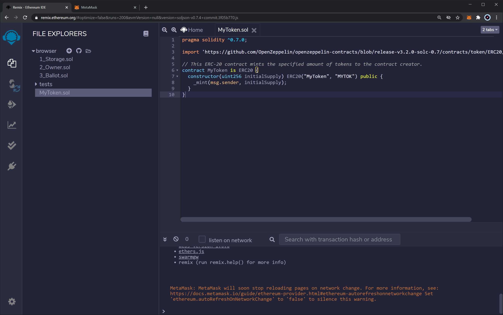

Now, navigate to the compile sidebar option to press the “Compile MyToken.sol” button:

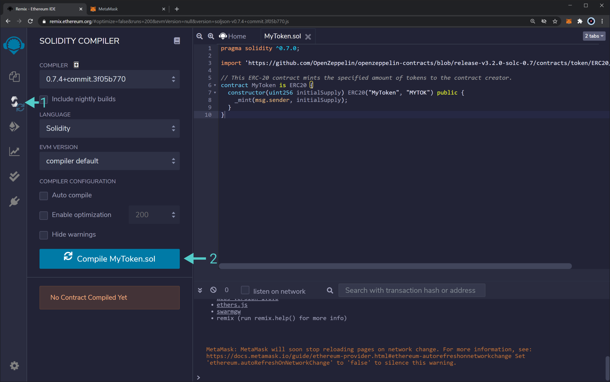

You will see Remix download all of the Open Zeppelin dependencies and compile the contract.

## Deploying a Contract to MinixChain Using Remix

Now we can deploy the contract by navigating to the Deployment sidebar option. You need to change the topmost “Environment” dropdown from “JavaScript VM” to “Injected Web3”.  This tells Remix to use the MetaMask injected provider, which will point it to your MinixChain  node.

As soon as you select "Injected Web3", you will be prompted to allow Remix to connect to your MetaMask account. Press “Next” in Metamask to allow Remix to access the selected account.

Back on Remix, you should see that the account you wish to use for deployment is now managed by MetaMask. Next to the Deploy button, let’s specify an initial supply of 8M tokens. Since this contract uses the default of 18 decimals, the value to put in the box is `8000000000000000000000000`.

Once you have entered this value, select "Deploy."


You will be prompted in MetaMask to confirm the contract deployment transaction.

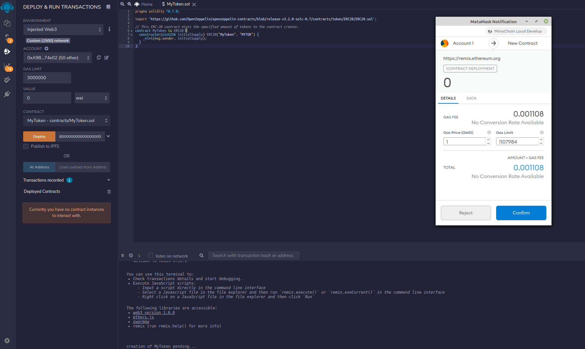

After you press Confirm and the deployment is complete, you will see the transaction listed in MetaMask. And the contract will appear under Deployed Contracts in Remix.

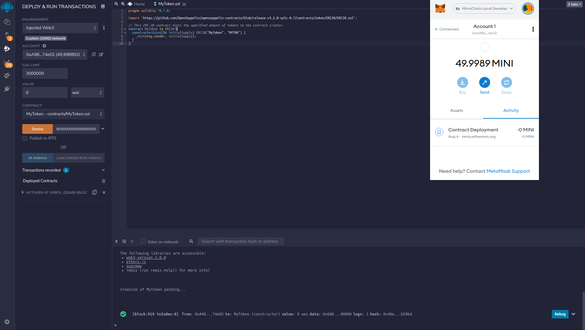

Once the contract is deployed, you can interact with it from within Remix.

Drill down on the contract under “Deployed Contracts.” Clicking on name, symbol, and totalSupply should return “MyToken,” “MYTOK,” and “8000000000000000000000000” respectively.

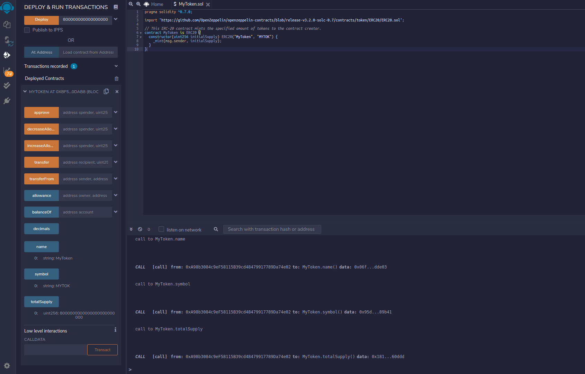

 If you copy the account address from which you deployed the contract and paste it into the balanceOf field, then click balanceOf button , you should see the entirety of the balance of the ERC20 as belonging to that user. 

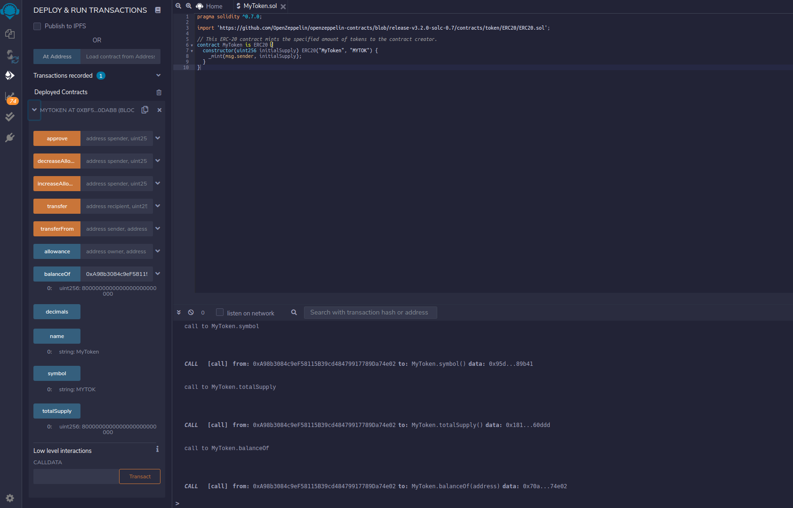


At last, copy the contract address by clicking the button next to the contract name and address.

## Interacting with a MinixChain-based ERC-20 from MetaMask

Now, open MetaMask to add the newly deployed ERC-20 tokens. Before doing so, make sure you have copied the contract's address from Remix. Back in MetaMask, click on “Add Token” as shown below. Make sure you are in the account that deployed the token contract.

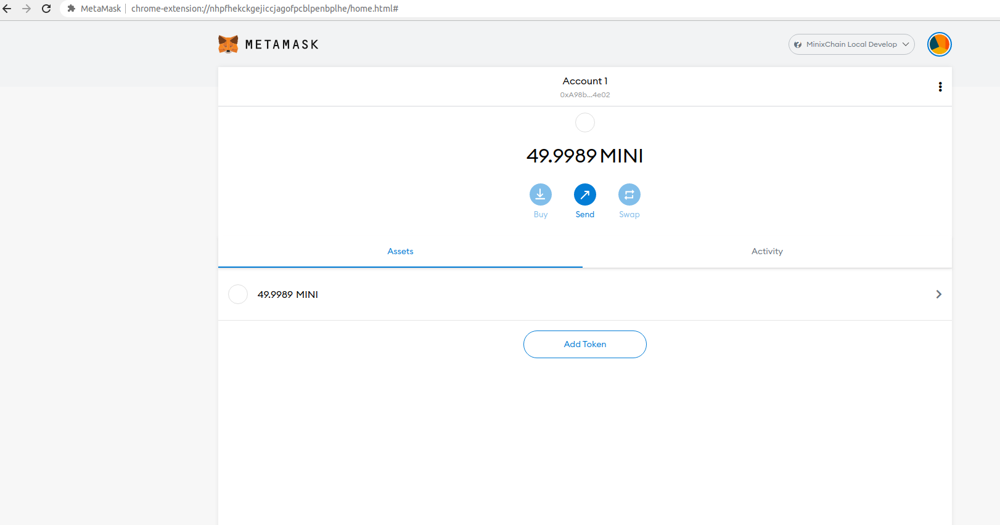

Paste the copied contract address into the “Token Contract Address” field. The “Token Symbol” and “Token Decimal” fields should be automatically populated.

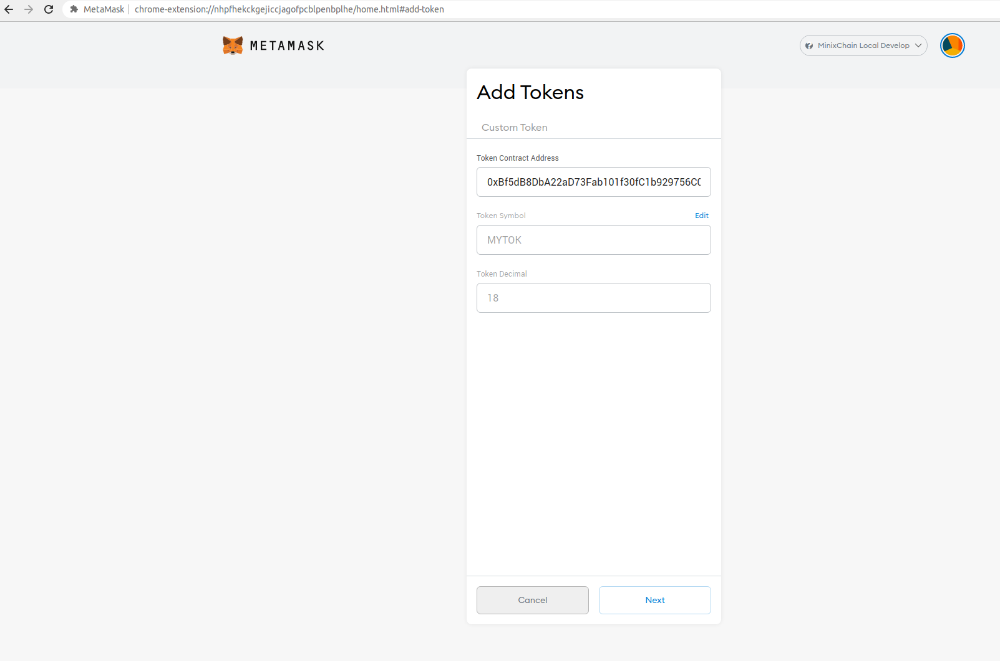

After hitting “Next,” you will need to confirm that you want to add these tokens to your MetaMask account. Hit “Add Token” and you should see a balance of 8M MyTokens in MetaMask:

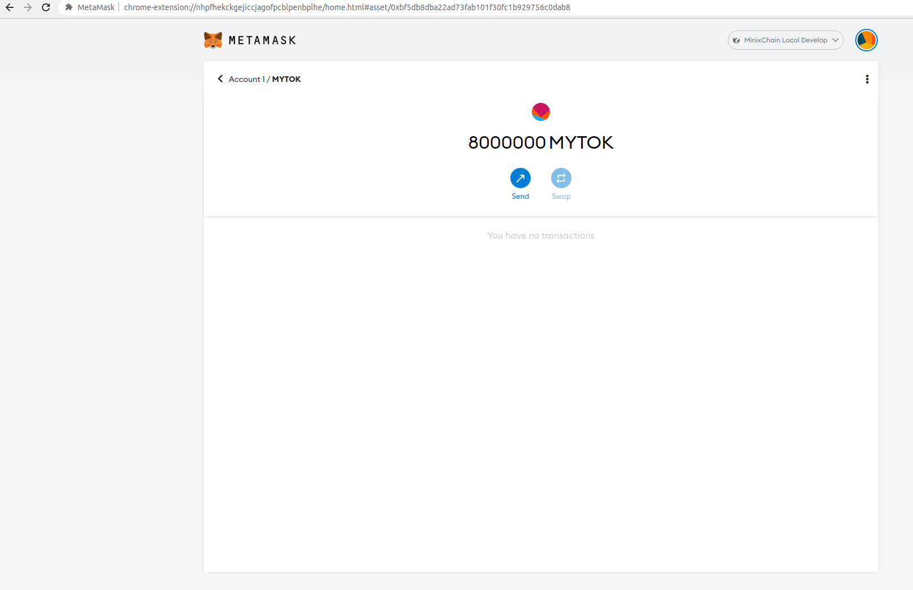

Now we can send some of these ERC-20 tokens to the other account that we have set up in MetaMask. Hit “send” to initiate the transfer of 500 MyTokens and select the destination account.

After hitting “next,” you will be asked to confirm (similar to what is pictured below).

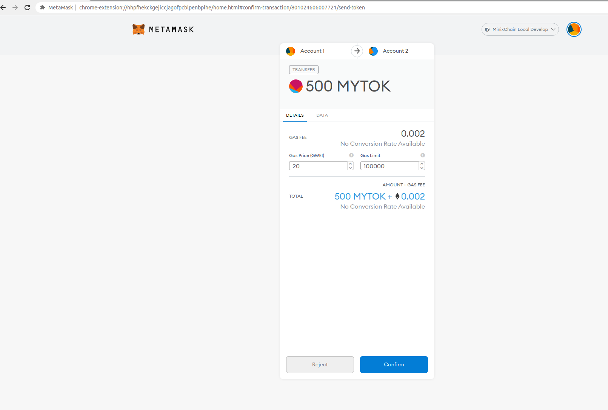

Hit “Confirm” and, after the transaction is complete, you will see a confirmation and a reduction of the MyToken account balance from the sender account in MetaMask:

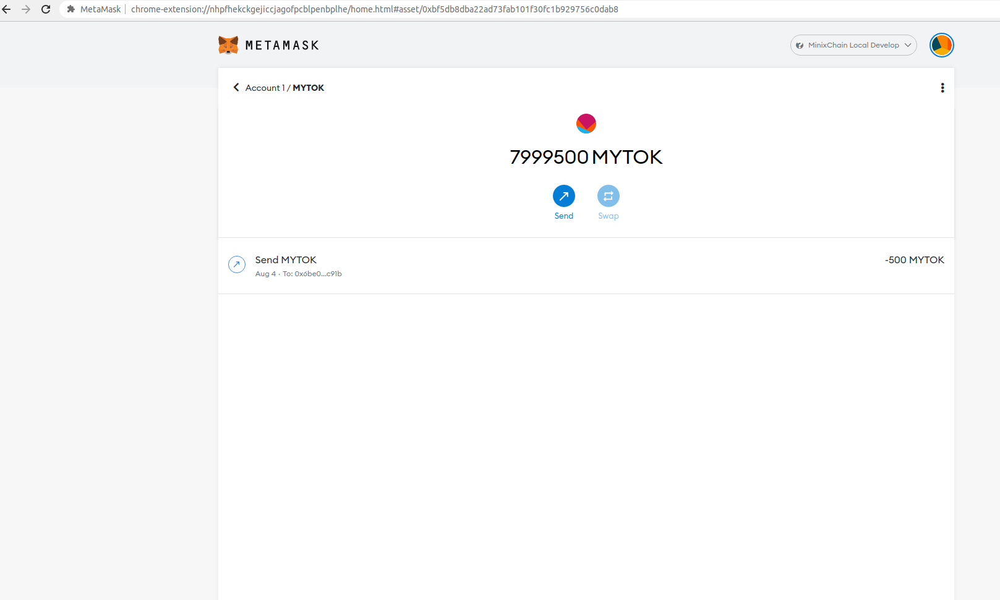

If you own the account that you sent the tokens to, you can add the token asset to verify that the transfer arrived.

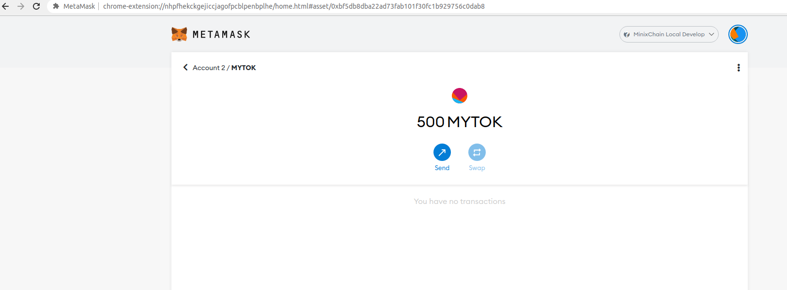
